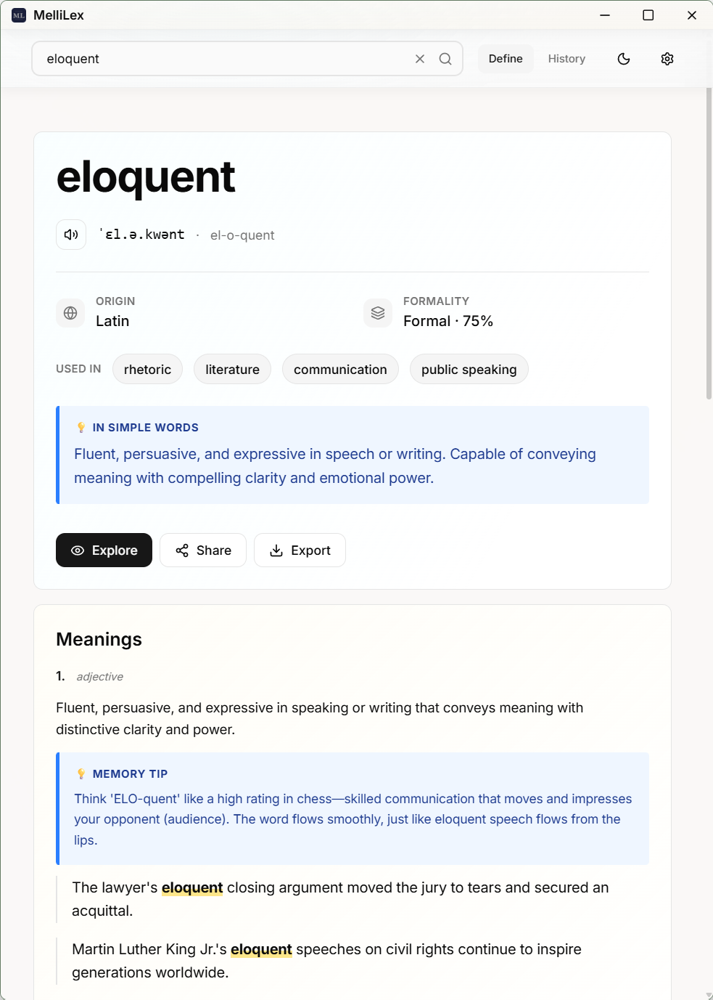
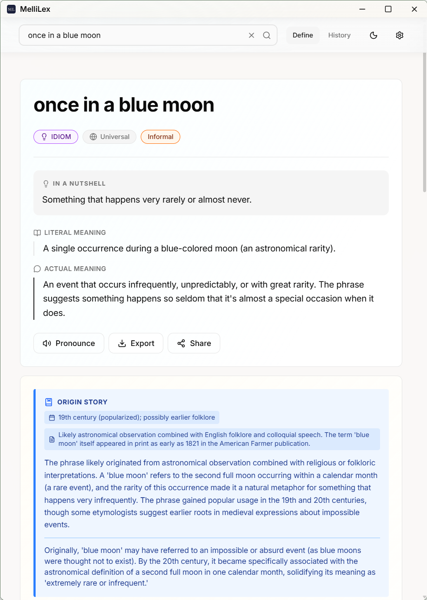
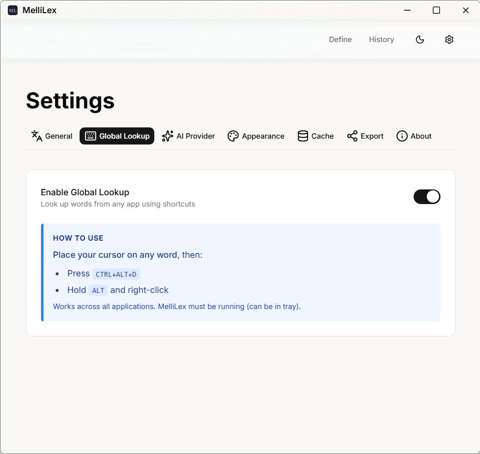
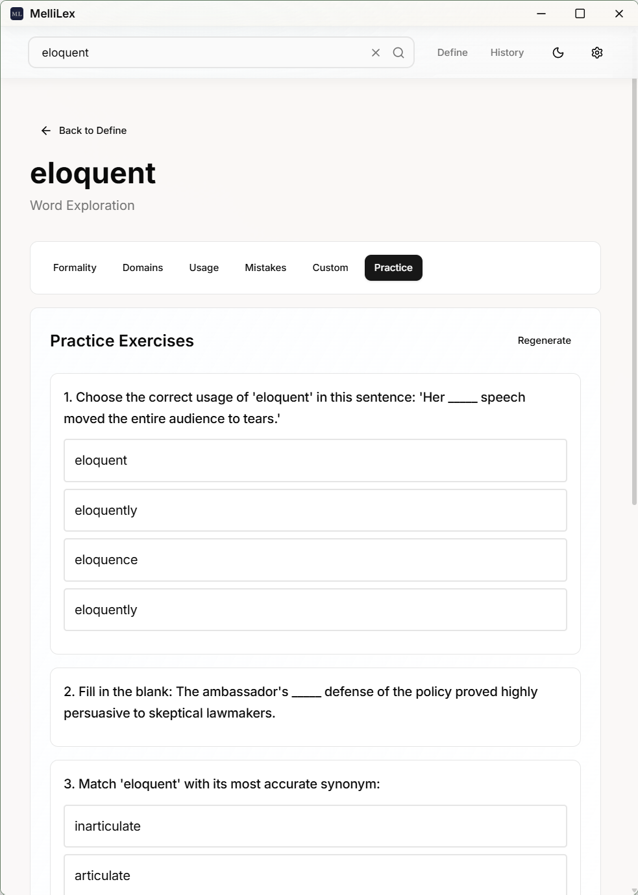
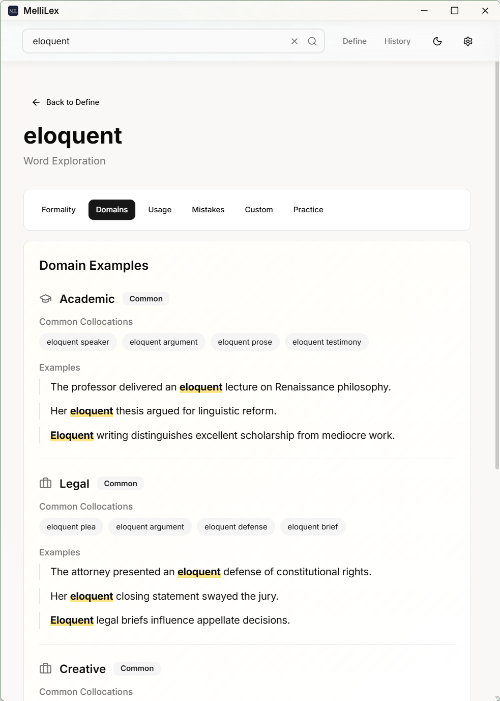
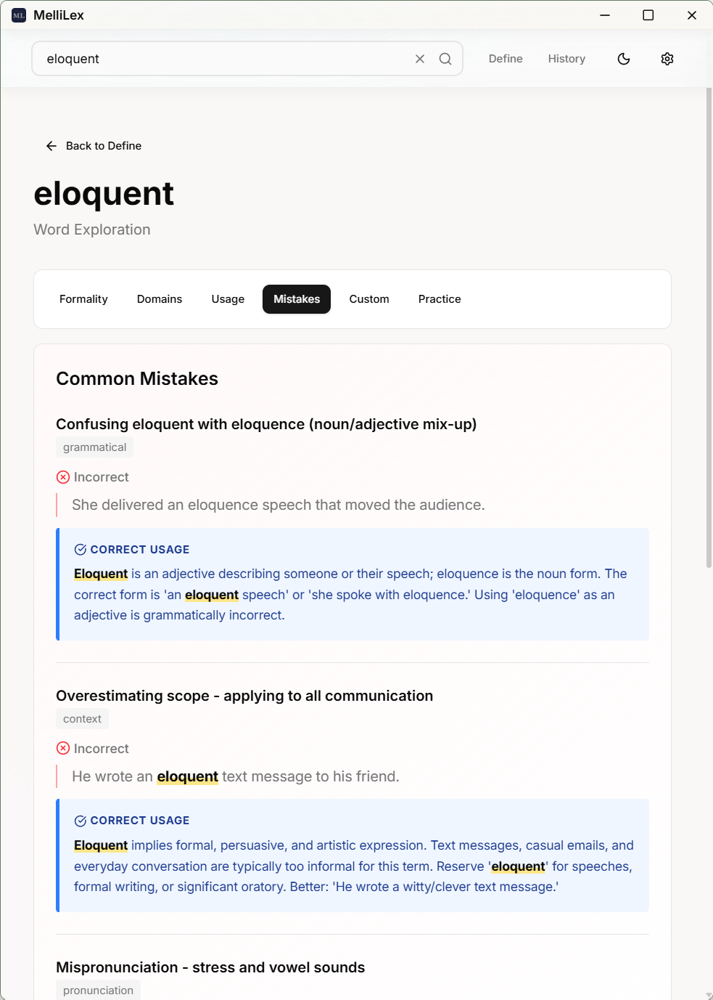

# MelliLex

> AI-powered word and phrase explorer for Windows

MelliLex is a Windows desktop app that lets you instantly look up meanings, usage, formality, and vocabulary context for any word or phrase — powered by the AI provider of your choice.

{height=800}
{height=800}

## Features

- **Instant lookup** via global keyboard shortcut or clipboard capture
{height=400}
- **Explore mode**: practice exercises, common mistakes, formality analysis, domain exploration
{height=400}
{height=400}
{height=400}

- **OCR capture** — select text from anywhere on screen, even non-selectable UI. Works with Kindle Windows app.
- **Phrase support**: full phrase definitions, context, and examples
- **Spell check**: SymSpell-powered corrections before lookup
- **Search history**: revisit previous lookups
- **Export**: save results to Markdown and Capacities
- **11 UI languages**: English, German, Spanish, French, Italian, Japanese, Korean, Portuguese, Russian, Turkish, Chinese
- **Multiple AI providers**: OpenAI, Anthropic, Google Gemini, Ollama (local)
- **Auto-updates**: built-in update checker

## Supported AI Providers

| Provider | Recommended Model 
|---|---
| Anthropic | Claude Haiku 4.5  
| Google Gemini | Gemini 2.5 Flash Lite  
| Ollama | Any local model 

## Installation

Download the latest installer from the [Releases](https://github.com/trrahul/MelliLex/releases) page.

**Requirements:**
- Windows 10 or 11

## Getting Started

1. Install MelliLex and launch it from the system tray
2. Open **Settings → AI Provider**
3. Select your provider and paste your API key
4. Search for a word or phrase

## License

[MIT](LICENSE)
